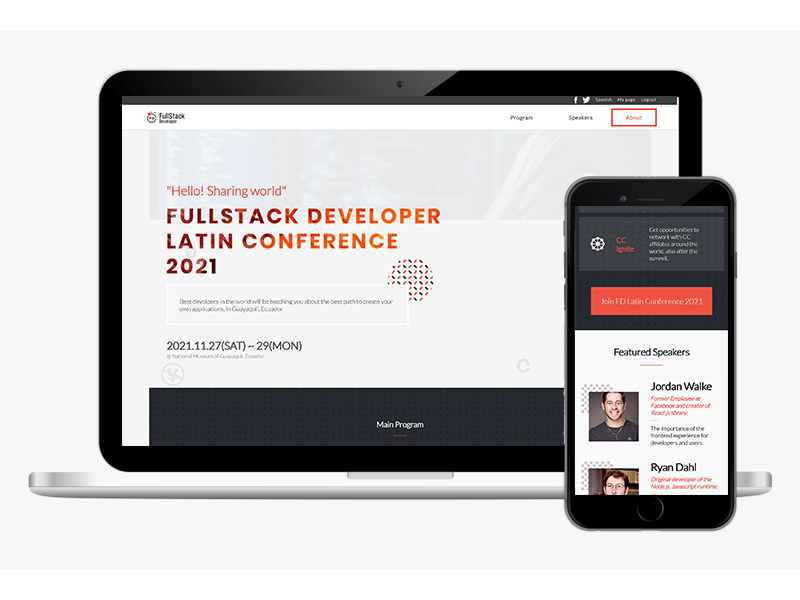

# FullStack Developer Latin Conference

> This project is going to show information about the content and speakers of the next FullStack Developer Latin Conference. This is my Module one Capstone project ⭐️

This conference website is fully responsive and has a great design, the mobile menu has a nice transition when its opening and closing, the speakers section is dynamically generated with JS. This project does not uses any CSS frameworks, only CleanCSS and media queries. 

## Live Link

- Before you read all the README content, [check out the live version. ⭐️](https://rafaelechart.github.io/ModuleOne_Capstone/) 

## Step by Step walkthrough of the website

- Step by step explanation of the page BY ME 🤝. [Here.](https://www.loom.com/share/c6ab47967f80494c8aab1b1310655975) 

## Built With

- HTML & CSS (Media Queries)
- Javascript
- Photoshop (Background images)
- Linters
- Git & Github

## Repo Link

- https://github.com/RafaelEchart/ModuleOne_Capstone

## Getting Started

To get a local copy up and running follow these simple example steps.

### Prerequisites

- Git in your local machine
- Code editor (VS code, Atom, etc)
- [HTML & CSS & JS Linters](https://github.com/microverseinc/linters-config/tree/master/html-css-js)
- Terminal

### Setup

- git clone https://github.com/RafaelEchart/ModuleOne_Capstone
- cd ModuleOne_Capstone

### Usage

- Add the changes you want and feel free to use it in your own projects!

### Run tests

- Check that all the tests are correctly passed🤝

### Merge

- Merge it with your main branch so everybody can see your code! Don't forget to tag me 🤝

## Authors

👤 **Author**

- GitHub: [@rafaelechart](https://github.com/rafaelechart)
- Twitter: [@rafaechart](https://twitter.com/rafaechart)

## 🤝 Contributing

Contributions, issues, and feature requests are welcome!

## Show your support

Give a ⭐️ if you like this project!

## Acknowledgments

- Thanks to [Cindy Shin](https://www.behance.net/adagio07) for creating this [amazing layout ⭐️](https://www.behance.net/gallery/29845175/CC-Global-Summit-2015)
- Myself and Microverse Documentation ⭐️

## 📝 License

This project is [MIT](./MIT.md) licensed.
